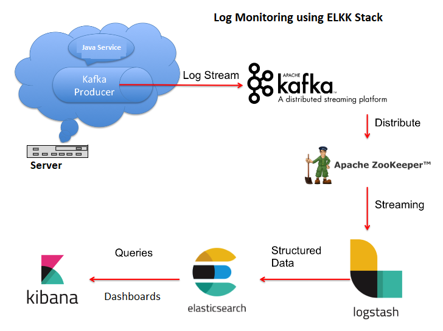
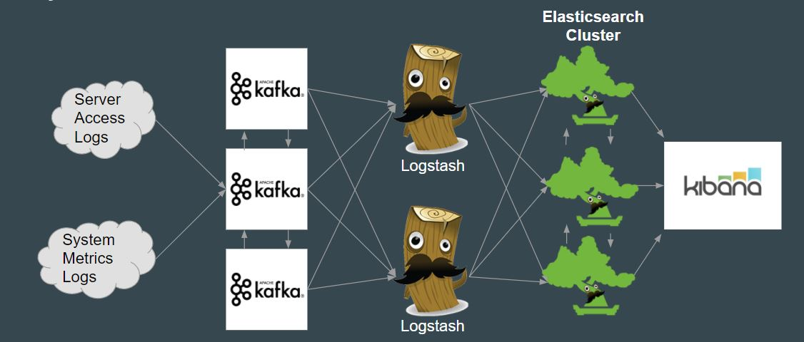

# Log Management & Server Monitoring using ELK Stack
This projects aims to build a data ingestion pipelining system that can be used to manage and then analyze server log and system metrics data. The logging information will be available real-time from multiple streaming sources(nodes) and be fed into Apache Kafka. From Kafka queues, the data will be consumed by Logstash, which will process and filter relevant information, before indexing it to ElasticSearch for storage. We configure dashboards in Kibana to display visualizations, alerts, and anomalies.

## Objective
### Sub-task 1
- Fetch data from Edgar webpage and get apache logs
- Process and push logs to Kafka
- Logstash fetches logs and after processing, pushed to ElasticSearch
- Use Kibana to analyze the data
### Sub-task 2
- Generate CPU stats(can be extended to any other metric) from each node and push to Kafka
- Process and push logs to Kafka
- Logstash fetches logs and after processing, pushed to ElasticSearch
- Use Kibana to analyze the data
### Sub-task 3
- Setup everything listed above on NCSU's VCL nodes or Amazon AWS EC2 instances

## Data Source
1) Edgar's Apache server logs (https://www.sec.gov/dera/data/edgar-log-file-data-set.html)
2) Each nodes' live CPU usage information

## Requirements
- Kafka
- Python
- Pip
- Java
- Logstash
- Kibana
- ElasticSearch

## System Design 

## Architecture


## Steps to run
- We need a minimum of 6 machines in total. This can be scaled to any number provided the configuration is set correctly.

### Installing Zookeeper and Kafka
- Download the latest version of Kafka from https://kafka.apache.org/downloads to 3 nodes.
- From the `kafka-config` folder in the repo, copy server1.properties and zookeeper1.properties to node 1.
- Similarly, server2.properties, server3.properties, zookeeper2.properties and zookeeper3.properties to nodes 2 and 3.
- In all 3 nodes, create a folder `zookeeper` under the `/var` folder.
- Under `/var/zookeeper` folder create a new file called `myid` file with content 1, 2 and 3 respectively for node1, node2 and node3.
- Make respective changes to server#.properties and zookeeper#.properties so that the ip addresses of the 3 nodes are reflected.
- After this, we start zookeeper by running the following command in the `bin` folder of the downloaded Kafka: `nohup ./zookeeper-server-start.sh {path of file}/zookeeper#.properties &`. Where '#' is the number of the node
- Once we start zookeeper in all 3 nodes, we start Kafka by running the following command on all 3 nodes: `nohup ./kafka-server-start.sh {path of file}/server.properties &`

### Installing Logstash, ElasticSearch and Kibana
- Install Oracle Java 8 using the following commands in the terminal
```
sudo add-apt-repository ppa:webupd8team/java
sudo apt-get update
sudo apt-get install oracle-java8-installer
```
- Install Elasticsearch by running the following commands in the terminal
```
wget -qO - https://artifacts.elastic.co/GPG-KEY-elasticsearch | sudo apt-key add -
sudo apt-get install apt-transport-https
echo "deb https://artifacts.elastic.co/packages/5.x/apt stable main" | sudo tee -a /etc/apt/sources.list.d/elastic-5.x.list
sudo apt-get update && sudo apt-get install elasticsearch
```
- Update the hosts file at /etc/hosts to include the IP address and names of the other nodes in Elasticsearch cluster
```
sudo vi /etc/hosts
```
- Update the config file at `/etc/elasticsearch/elasticsearch.yml` with the one in the git repository. Change the necessary params like node name and node ip address.
- Setup elasticsearch service to auto start on system boot
```
sudo systemctl restart elasticsearch
sudo update-rc.d elasticsearch defaults 95 10
```
- Enable firewall to allow communication through the ports 9200 and 9300
```
sudo iptables -I INPUT -j ACCEPT -p TCP --dport 9200
sudo iptables -I INPUT -j ACCEPT -p TCP --dport 9300
sudo iptables -I OUTPUT -j ACCEPT -p TCP --dport 9200
sudo iptables -I OUTPUT -j ACCEPT -p TCP --dport 9300
```
- Install logstash and kibana using the following commands. Note: It is enough to install kibana in only one of the nodes in the ElasticSearch cluster. 
```
sudo apt-get install logstash
sudo apt-get install kibana
```
- Update the kibana configuration file at `/etc/kibana/kibana.yml` by replacing the existing file with the one in git repository.
- Start logstash and kibana service
```
sudo systemctl restart logstash
sudo systemctl restart kibana
```
- Enable firewall to allow communication through port 5601 for Kibana access
```
sudo iptables -I INPUT -j ACCEPT -p TCP --dport 5601
sudo iptables -I OUTPUT -j ACCEPT -p TCP --dport 5601
```
- Check if elasticsearch if running
```
curl 'http://NODE_IP_ADDRESS:9200/?pretty'
```
You should see a similar response
```
{
  "name" : "ES Cluster",
  "cluster_name" : "elasticsearch",
  "version" : {
    "number" : "5.3.1",
    "build_hash" : "72cd1f1a3eee09505e036106146dc1949dc5dc87",
    "build_timestamp" : "2017-11-18T22:40:03Z",
    "build_snapshot" : false,
    "lucene_version" : "5.3.1"
  },
  "tagline" : "You Know, for Search"
}
```
- Open a browser and navigate to the URL `http://NODE_IP_ADDRESS:5601`. You should be able to see the default kibana page.
- Copy a logstash configuration file to the VCL node and run the following command
`sudo /usr/share/logstash/bin/logstash -f logstash.conf`. One should see the messages in the kafka topics being pushed to elasticsearch  index in the console.
